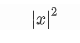
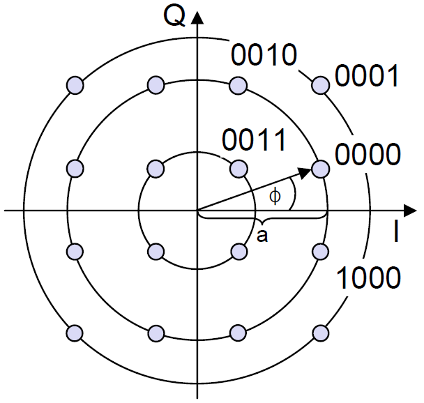
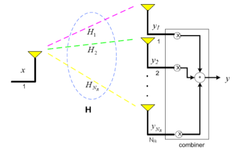
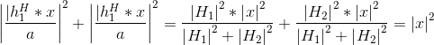
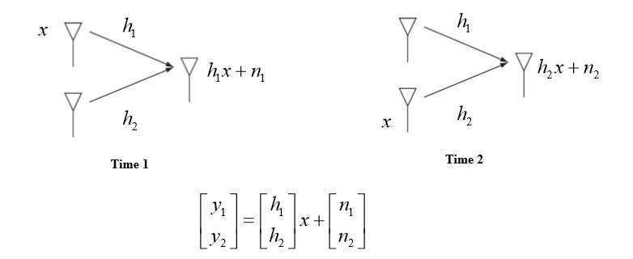
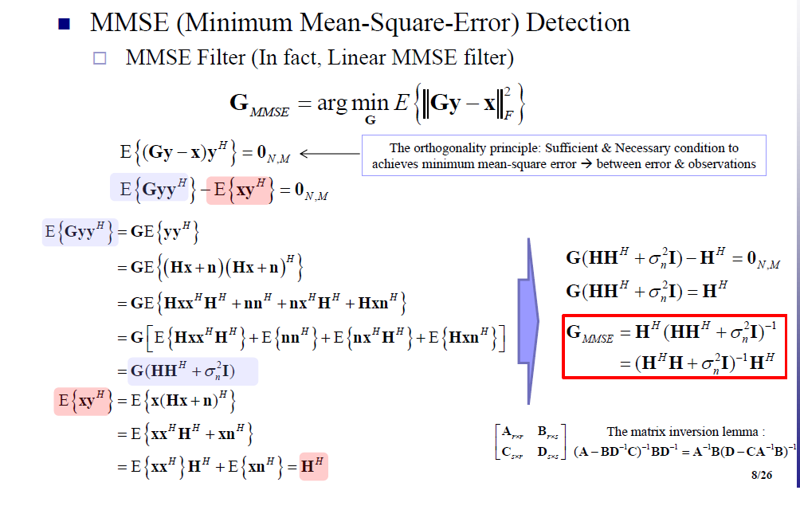

Research_assistant

# Research_assistant

# SISO

- **Single Input Single Output**
- 단일 송신 안테나, 단일 수신 안테나
- 안테나 diversity 효과 없음

-  MISO 시스템에서 Transmit Diversity를 달성하기 위한 송신 방법 중 하나 

-  SIMO의 SC와 동일한 원리 

-  동일한 성능 

-  SISO 환경과 동일한 신호 파워로 전송

Transmitt Power: 

## BPSK

- **디지털 신호(1,0)**에 따라 위상이 180˚ 다른 두 정현파로 변조하는 방식

## QPSK

- 2진 PSK(BPSK) 방식과 달리, 위상을 90˚씩 변화함
- **4개 종류의 디지털 심볼(00, 01, 10, 11)**로 전송하는 4진 PSK 방식

## 16QAM

 

- QAM (Quadrature Amplitude Modulation)
- 한 심볼에 n bit 코딩 (16QAM은 1 symbol = 4 bits)

- 한 심볼에 전송할 수 있는 bit 수

  - BPSK : 1 bit
  - QPSK : 2 bits
  - 16 QAM : 4 bits
  - 64 QAM : 6 bits

  

## Rayleigh fading

- 신호가 많은 **물체와 빌딩사이에 가려 잘 도달하지 않고**, 주로 반사파들이 여러 다중 경로에 의해 수신측에 도달하여 합성하는데, 이때 신호 강도가 빠르게 요동치며 생기는 현상을 말한다.
- 건물이 많이 세워진 도심지에서 유용한 모델

## BER

- Bit Error Ratio (비트 오류율) 
  

## SER

- Symbol Error Ratio(심볼 오류율)

## SNR

- **신호 대 잡음 비** (Signal to noise ratio)
- SNR이 크다 = 잡음보다 신호의 power가 더 크다

## Eb/N0

- 정의 : 디지털 통신의 성능평가 기준으로 **비트에너지 대 잡음전력 스펙트럼 밀도의 비**

## BER/SER 과 SNR/EbN0 Graph 비교

___

___

# SIMO

- **Single Input Multiple Output**

## Diversity

- 송신, 수신측에 복수 개의 안테나(다중 안테나)를 설치하여 Diversity 효과를 얻는 방법

___

___

# MISO

## Maximal -Ratio Transmission(MRT)

- **SIMO의 MRC와 동일한 원리-->동일성능**
  
- 차이점) 채널 정보를 송신단에서 알고 있어야 함. 
  
- 송신 Power를 더 쓰지 않도록 각 송신 안테나 신호에 대한 Power Normalization이 필요

  

  

## Selection

-  MISO 시스템에서 Transmit Diversity를 달성하기 위한 송신 방법 중 하나 

-  SIMO의 SC와 동일한 원리 

-  동일한 성능 

-  SISO 환경과 동일한 신호 파워로 전송

  

Transmit Power : 

## Alamouti STBC

##### pre) 

##### 	MRT (Maximal-Ratio Transmission) / Antenna Selection 

-  MISO System을 위한 Diversity 달성 기법 
-  송신단에서 채널 정보를 알아야만 사용 가능한 기술들 
   -  MRT : 정확한 채널 값 
   -  Antenna Selection: 어떤 안테나의 채널이 더 좋은지 
      -  수신단에서부터 송신단으로의 피드백이 기본적으로 필요

#### Alamouti STBC

___

- 각 시간마다 한 TX Antenna만을 사용하여 Diversity를 확보하는 방 법
  -  본 기법: 0.5 심볼 전송 / 시간, 채널 정보 필요 X (MISO)	
  -  MRT: 1 심볼 전송 / 시간, 채널 정보 필요 O (MISO) 
  -  MRC: 1 심볼 전송 / 시간, 채널 정보 필요 X (SIMO) 

- *Alamouti STBC – Equivalent System Model*

- *Detection for the 1st TX symbol*

  

- *Detection for the 2nd TX symbol*

- Alamouti STBC in MISO Systems (2x1)

  -   두 개의 신호를 두 번의 시간 동안 전송함

  -   두 전송 신호에 대해 두개의 채널(Diversity)을 보장하며, 또한 상호간 간섭 없는 신호를 추출할 수 있는 간단한 복호과정을 가짐 

  - Alamouti STBC: 1 심볼 전송 / 시간, 채널 정보 필요 X (MISO 2x1)

  -  Simple STBC: 0.5 심볼 전송 / 시간, 채널 정보 필요 X (MISO) 

  -  MRT: 1 심볼 전송 / 시간, 채널 정보 필요 O (MISO) 

  -  MRC: 1 심볼 전송 / 시간, 채널 정보 필요 X (SIMO) 

    

- 상기 기법들은 2x1 MISO / 1x2 SIMO를 가정할 때 모두 2개의 독립 적인 채널을 통한 Diversity 획득

  

-  Alamouti STBC의 제약 사항 

  -  MISO 시스템 중에서는 2x1 환경에만 적용 가능
  - 두 전송 시간동안 채널이 변하지 않아야 최대 성능 보장. 
    -  채널이 변화할 경우 간섭 성분이 남을 수 있음
    
     

___

___

# MIMO

- **Multiple-Input and Multiple-Output**
- 다수의 송신 안테와 다수의 수신 안테나 시스템
- Spatially multiplexing (공간 다중화) 개념과 Spatial Diversity (공간 다이버시티) 개념이 포함됨

보통 MIMO System Model은 N개의 TX, M개의 RX를 가진다.

- y : M x 1 receive signal vector
- H : M x N **MIMO** channel matrix
- x : N x 1 transmitted signal vector
- n : M x 1 AWGN (Additive white Gaussian noise) vector

## ZF (Zero-Forcing)

### ZF Filter

### Output of the ZF receiver

- M < N 인 시스템에서는 사용할 수 없다.
- Diversity order가 이다.
- Linear receivers 이다.

송수신 수식에서 H를 이용해 H의 **에르미트 행렬**을 구하고 이를 이용해 **ZF Filter**를 구한다.  

구한 **ZF Filter**를 수식에 곱하여 수신 심벌 x + N(이외의 수) 꼴로 보상해준다.

## MMSE (Minimum Mean Square Error)

- 여기서 는 잡음 전력의 분산의 제곱이다.
- M < N 인 시스템에서는 사용할 수 없다.
- Diversity order 는  로  ZF 와 같다.
- Error Performance는 ZF 보다 좋다.
- Linear receivers 이다.

## ML (Maximum-likelihood)

를 만족하는 X를 찾는 알고리즘이다. 

즉, x에 들어갈 수 있는 모든 조합을 구하여 H를 곱한 후, 수신 심벌 y에서 뺀 값이 최소인 x가 Demodulation한 값이 된다. 

- Optimal performance를 가지고 있다. (즉 최적화가 잘 되어 있다.)
- 하지만 복잡하고 연산 시 시간이 많이 필요하다.
- Non-Linear receivers 이다.

### Diversity order 비교 (ZF, MMSE, ML)

## SIC (Successive Interference Cancellation)

- **Based on the Linear Receiver (MMSE, ZF)**
- **Serial IC** 라고도 부른다.
- 자료에 있는 설명
  - First, Estimate ont of TX symbols using Linear Filter
  - Second, Cancel it from the RX vectors, as if the TX symbol was no actually transmitted -> Go to First
- 해석
  1. 선행 필터(MMSE, ZF)를 통해 송신부에서 온 symbol을 복조한다.
  2. 수신부에 섞인 간섭을 제거하여 다시 선행 필터를 통해 필터링한다. 아직 남은 송신 심벌이 남아 있다면 1.번을 반복한다.

### Example

 

- ZF, MMSE 기법만 사용한 것 보다 성능이 좋다.
- ZF, MMSE 보다 복잡도가 증가된다.
- 하지만 ML 보다는 복잡도가 낮다.
- 주의점 Error Propagation(오류 전파)
  - 첫 심벌이 오류가 일어난 것이었다면 이 오류성은 후에 일어나는 일련의 과정들 모두에게 전파된다. 따라서 오류가 커질 수도 있다.

## OSIC (Ordered Successive Interference Cancellation)

- To minimize the occurence of error propagations in SIC
- SIC에서 Error Propagation을 최소화 하기 위해 고안된 방법
- TX에서 보낸 심벌의 SNR을 측정하여, 최대인 것을 SIC 연산식에서 우선순위를 둔다.(먼저 뺀다)
- SNR이 최대라는 것은 송신 및 수신과정에서 오류가 일어났을 확률이 최소이기 때문에, 우선순위를 둔다. 이에 따라 오류가 일어날 확률이 큰, 즉 SNR이 제일 작은 송신 심벌은 간섭이 제거되기 때문에 전체적으로 오류의 확률이 적어지게 된다.
- SNR을 구하기(구현과정이) 힘들기 때문에 행렬 $$H$$에서 열 순서로 $$h1, h2, h3, ...$$ 중 크기가 가장 큰 것으로 우선순위를 두어도 크게 상관은 없다. (정확한 OSIC는 아니지만, 연산 결과도 크게 차이나지 않는다.)

### SNR 구하는 과정 (어려움)

###  Diversity order 비교 (Normal, SIC, OSIC)

# OSIC-MMSE or ISDIC-MMSE
Orderd SIC(Succesive Interference Cancellation)

MMSE 기반의 반복 연판정 간섭 제거 기법

## 기법
1) 연판정 벡터  의 원소들을 모두 0으로, 잔여 간섭분산 벡터 의 원소들을 모두 1로, k를 1로 초기화한다.
2) k번째 Iteration에서 의 심볼 검출 순서를 정한다.
   1) 검출 순서는 조건(ex. 전력을 가장많이 가지고 있는 순서)을 어떻게 두느냐에 따라 다르다.
   2) 이때 라면 k번째 Iteration에서 가 n번째 순서임을 나타낸다.
3) 까지 다음 과정을 수행한다.
   1) 연판정 간섭 제거 신호 벡터 r, MMSE 검출 벡터 f를 계산한다.
   2) 
   3) 
4) D는 i번째 주대각 원소 1을 제외하고 n번째 주대각 원소가 인  대각행렬이며, 은  항등행렬이다. 일 때, s,v는 r,f를 통해 갱신된다.
   1) 
   2) 
   3) 